# HoloLens Workshop 😀

(🕙Required time: 60 mins)

## Pre-requisites

- A github account which is free to create (see details [here](https://docs.github.com/en/get-started/signing-up-for-github/signing-up-for-a-new-github-account))

- [Visual Studio Code](https://code.visualstudio.com/download) Windows/Linux/Mac

- An internet connection

> Note. If you can't install Visual Studio Code the workshop can still be completed using the standard text editor that is included with your operating system.

## Introduction

We will run through the simplest possible example of how to create an immersive experience that runs on HoloLens2. We will be using standard web technologies (html/javascript/css) but it is not necessary to have any prior experience with these. There is a new standard called [WebXR](https://www.w3.org/TR/webxr/) which allows immersive, interactive 3D experiences to be created on the web but consumed on different devices. The devices could be a HoloLens, a Virtual Reality headset or could be your mobile phone.

### WebGL

Whilst we are using html the technology that allows us to create 3D on the web is actually WebGL. There are a number of frameworks that we can use to make writing a WebGL app easier those include [Babylon.js](https://doc.babylonjs.com/) and [A-Frame](https://aframe.io/).

Let's get started...

We will need to carry out three distinct tasks:

Create or find A 3D model, create an html page which loads the 3D model and a Github page to host our web page.


First create a folder on your computer where we will save all of the files; we will refer to that folder as the `working folder`.

## 3D Model

We need a simple (non-animated) 3D model in the .glb file format before we continue. Here are some possible sources:

- create one using Paint3D

- download one from [this Github repo](https://github.com/peted70/HoloLensWorkshop/tree/main/3d-models) 

- find one on the web there are lots of sites that include free 3D models; e.g. https://sketchfab.com/

Copy the .glb file into your `working folder`.

## HTML Page

Open Visual Studio Code in a new folder on your computer

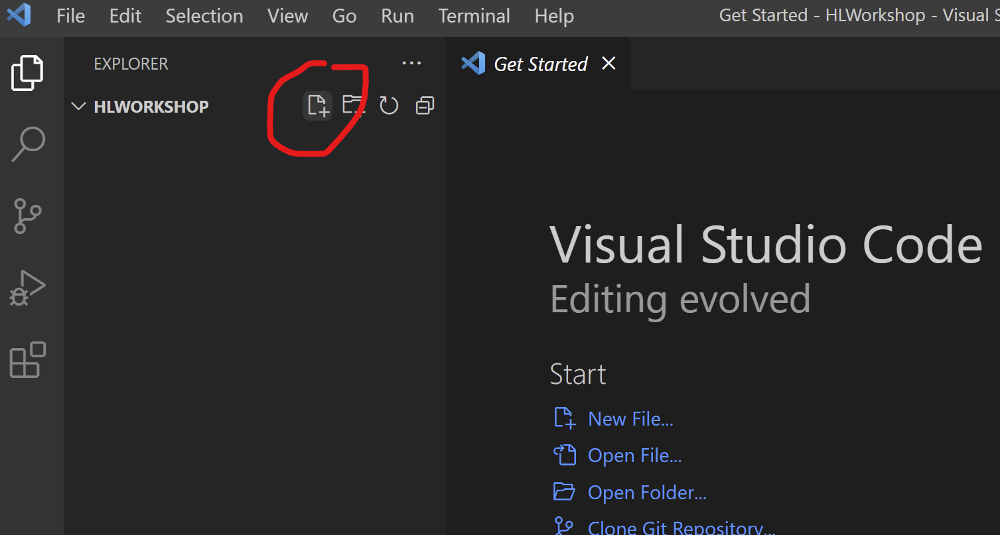

name it `index.html`

From within the file content type `doc` and hit the `Tab` key on your keyoboard and the contents of an html page should be created.

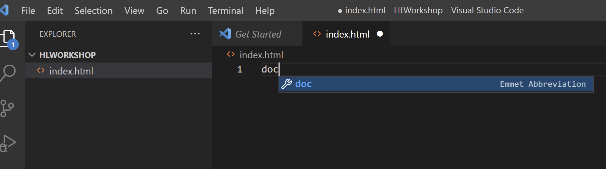

Resulting in:

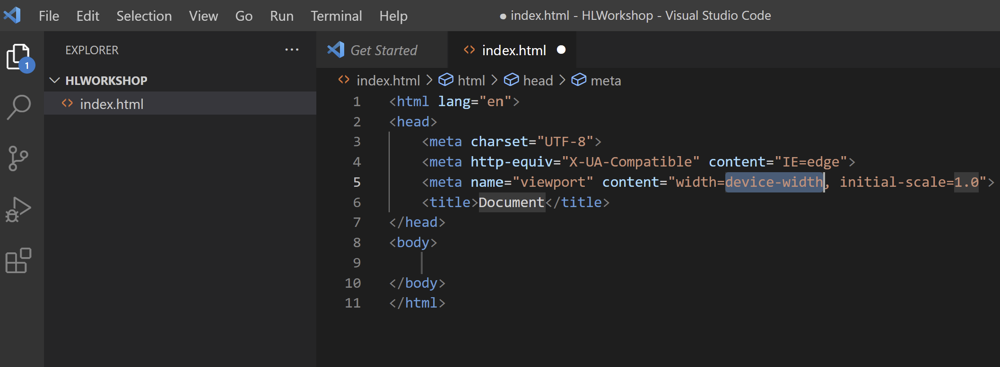

> If this doesn't work in your environment then copy the code below into the index.html file and save it.

```html
<html lang="en">
<head>
    <meta charset="UTF-8">
    <meta http-equiv="X-UA-Compatible" content="IE=edge">
    <meta name="viewport" content="width=device-width, initial-scale=1.0">
    <title>Document</title>
</head>
<body>
    
</body>
</html>
```

Change the text `Document` to a name of your choosing.

Add a script tag for the `A-Frame` library into the head section of your html page:

```html
<script src="https://aframe.io/releases/1.3.0/aframe.min.js"></script>
```

and copy the following html and place in the `body` section of you index.html page:

```html
<a-scene background="#00000000">
    <a-assets>
        <a-asset-item id="model" src="my-model-name.glb" response-type="arraybuffer"></a-asset-item>
    </a-assets>
    
    <a-entity gltf-model="#model" scale = "15 15 15" position="0 0 -10"></a-entity>  
        <a-camera>
            <a-cursor material="color: #FFF; shader: flat;"></a-cursor>
        </a-camera>
</a-scene>
```

Being careful to change `my-model-name.glb` for the filename of your 3D model.

Your `index.html` file should now look like this:

```html
<html lang="en">
<head>
    <script src="https://aframe.io/releases/1.3.0/aframe.min.js"></script>
    <meta charset="UTF-8">
    <meta http-equiv="X-UA-Compatible" content="IE=edge">
    <meta name="viewport" content="width=device-width, initial-scale=1.0">
    <title>My 3D Model Viewer</title>
</head>
<body>
    <a-scene background="#00000000">
        <a-assets>
            <a-asset-item id="model" src="sun.glb" response-type="arraybuffer"></a-asset-item>
        </a-assets>
        
        <a-entity gltf-model="#sun" scale = "15 15 15" position="0 0 -10"></a-entity>  
            <a-camera>
                <a-cursor material="color: #FFF; shader: flat;"></a-cursor>
            </a-camera>
    </a-scene>
</body>
</html>
```

## Github Page

First we need to create a new repository on Github and copy the index.html and model.glb file to it.

To create a repository:

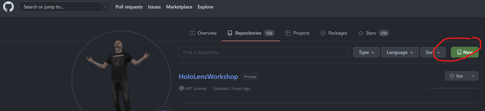

then,

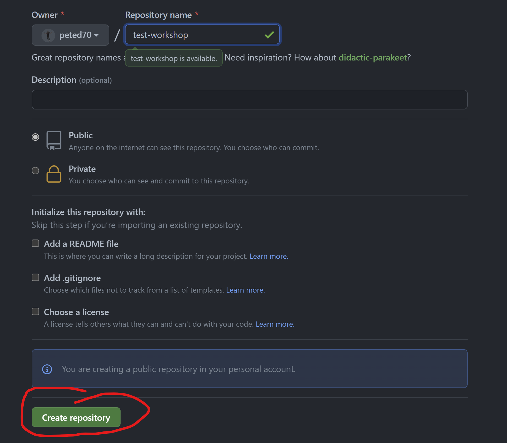

then,

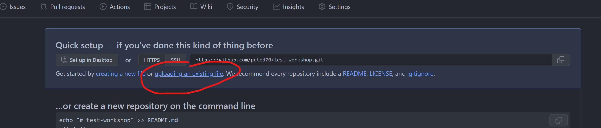

then drag and drop your files...

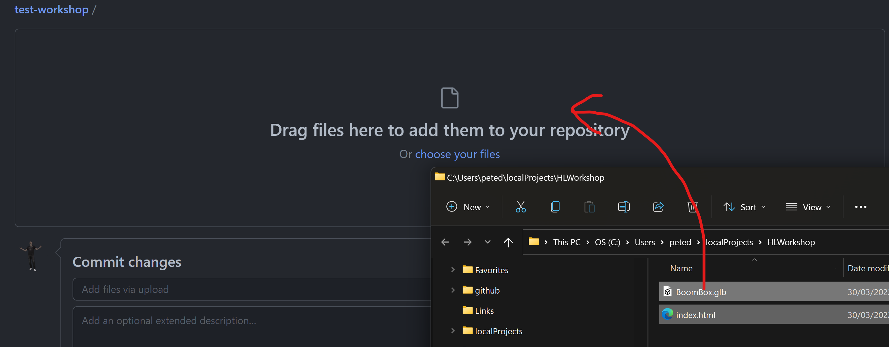

Commit the changes...

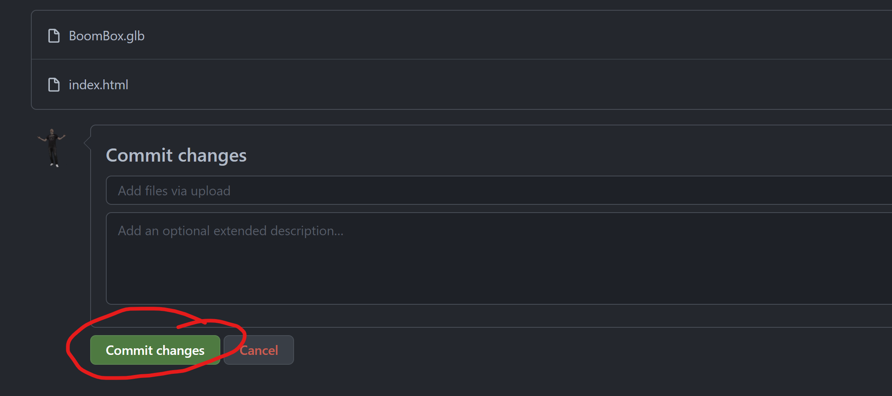

Your repo should now look like this:

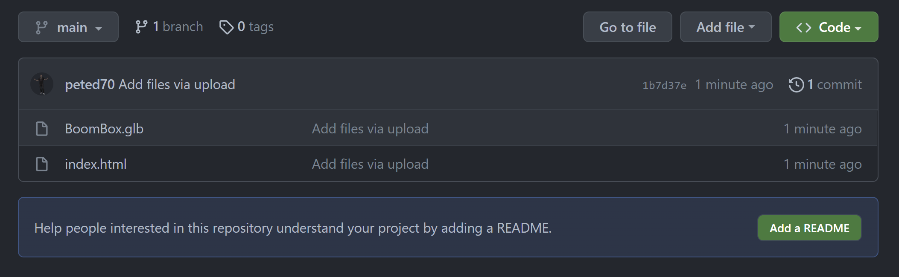


Now we will use Guthub Pages to host the html page.

Go to the settings page:

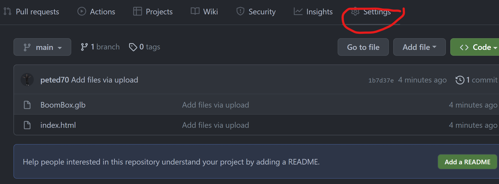

Then the Pages page:

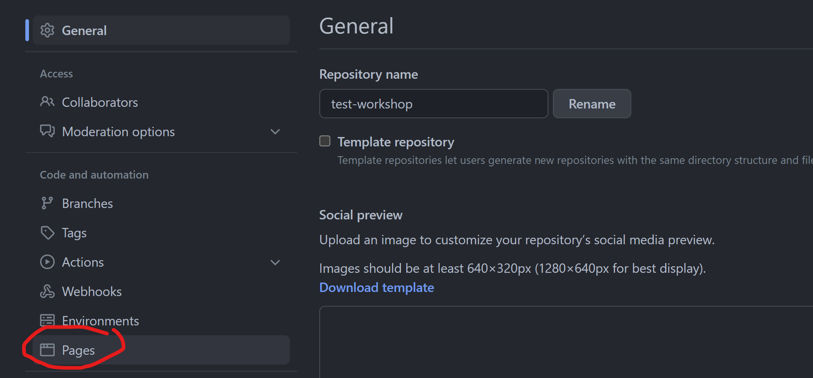

Now set your main branch as the source for your page and Save:

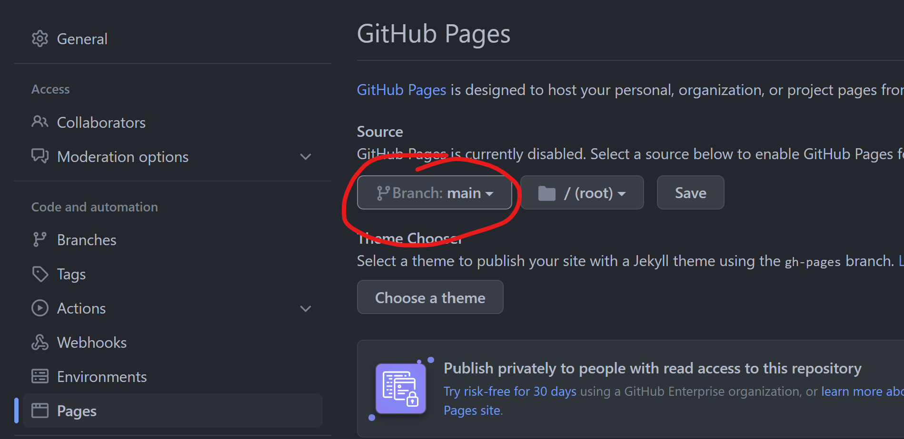

You will then see a page link like the following:

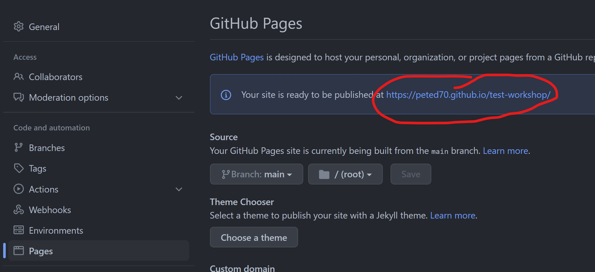

Clicking on the link will open the index.html page in your browser:

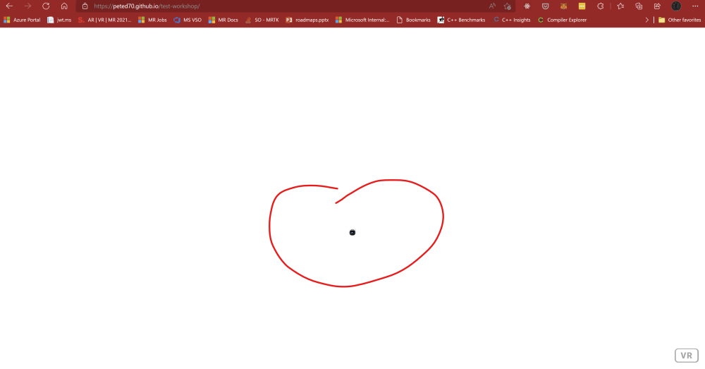

But notice that in my case the model is being rendered very small but we can fix this by editing the html and changing the scale value for the model:

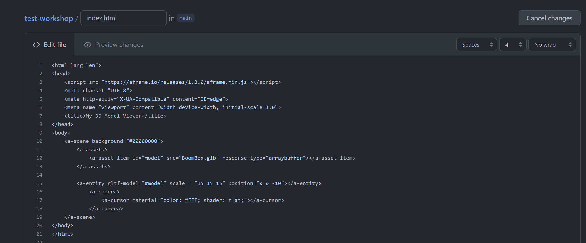

Change the values.

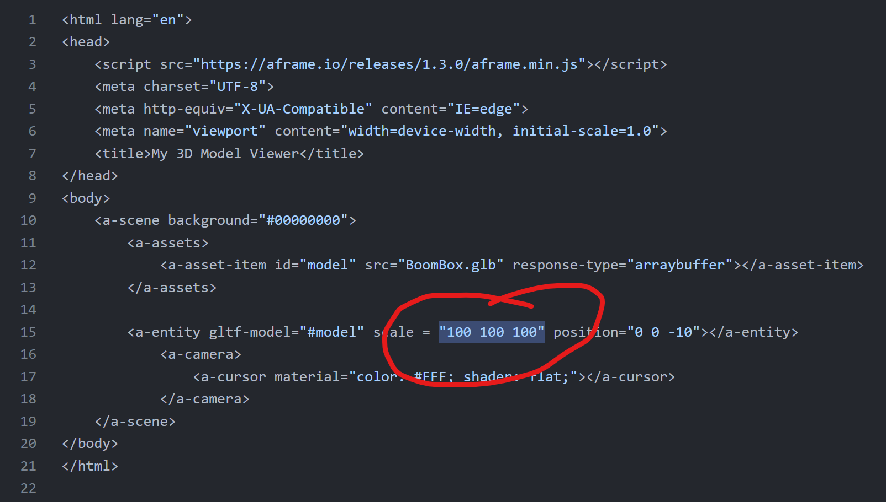

And then commit the changes...

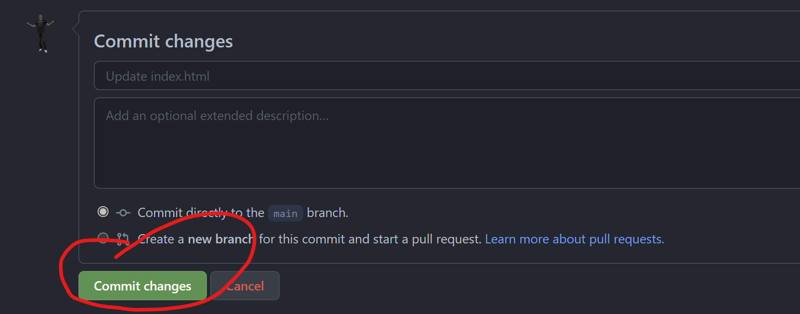

Wait for a while ☕☕☕☕☕

Then reload the page...

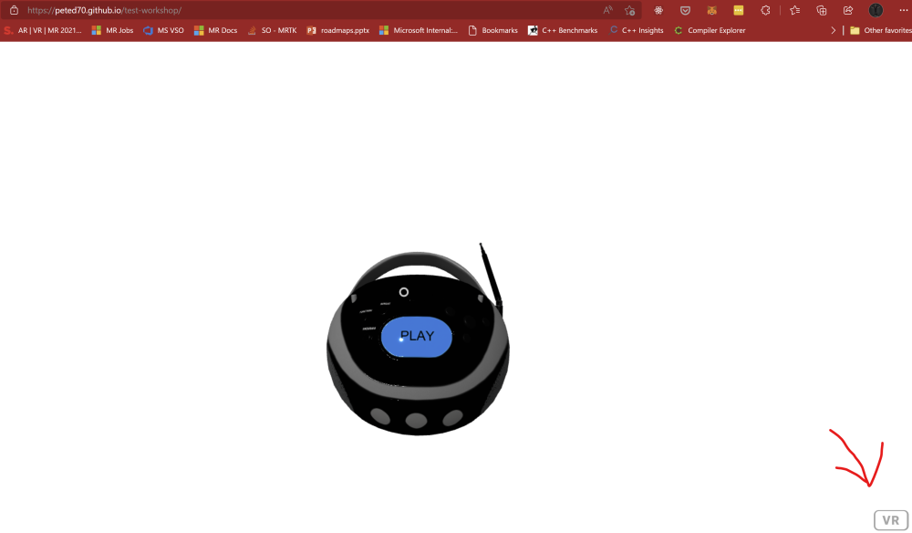

Notice the `VR` button at the bottom right of the page. If you navigate to this page from within a VR headset then activate the VR button you will enter a fully 3d, immersive experience viewing your 3D model.

We can do the same in a HoloLens2 where your model will be combined with the real-world.

You can try the one I made [here](https://peted70.github.io/HoloLensWorkshop/)

> You can use your mouse and arrow keys to navigate around the 3D model if you open this on a desktop or your finger if you are using a mobile phone.

And here it is running on a HoloLens2:


## Further Learning Resources

[WebXR Development with Javascript](https://docs.microsoft.com/en-us/windows/mixed-reality/develop/javascript/webxr-overview)

[VR Hello World using Babylon.js](https://docs.microsoft.com/en-us/windows/mixed-reality/develop/javascript/tutorials/babylonjs-webxr-helloworld/introduction-01)

[Build a piano in WebXR with Babylon.js](https://docs.microsoft.com/en-us/windows/mixed-reality/develop/javascript/tutorials/babylonjs-webxr-piano/introduction-01)