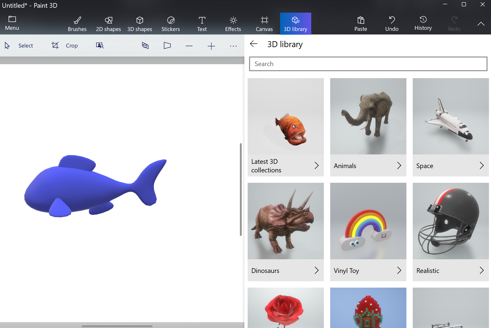
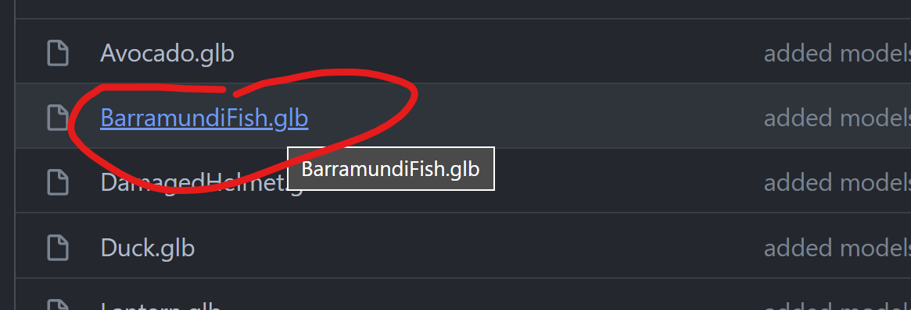
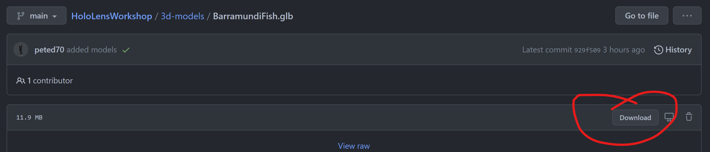

# HoloLens Workshop 😀

(🕙Required time: 60 mins)

## Pre-requisites

There are a few steps that you'll need to complete before the workshop starts: 

- [Install **Paint 3D**](https://www.microsoft.com/en-gb/p/paint-3d/9nblggh5fv99?activetab=pivot:overviewtab). Paint 3D is a reimagined version of the classic Microsoft Paint, that lets you make 3D models that you can play with from all angles. This is only available on Windows 10 or 11, but if you can't use Paint 3D, don't worry, you can still complete the workshop by downloading a pre-created 3D model (we provide some links in the workshop notes below). 

- [Install **Visual Studio Code**](https://code.visualstudio.com/download). Visual Studio Code is a lightweight but powerful source code editor which runs on your desktop and is available for Windows, macOS and Linux. If you can't install Visual Studio Code, don't worry, the workshop can still be completed using a standard text editor.

- [Create a free **GitHub** account](https://docs.github.com/en/get-started/signing-up-for-github/signing-up-for-a-new-github-account), if you don't have one already. GitHub is a code hosting platform that lets you and others work together on projects from anywhere.

- Make sure that you are connected to the internet during the workshop.

## Introduction

In this workshop we will create a simple, immersive and interactive 3D experience which we can view with a browser, mobile phone, virtual reality headset or even a  [HoloLens 2](https://www.microsoft.com/en-gb/hololens/) mixed reality headset! 


We will be using standard web technologies such as **HTML**, **JavaScript** and **CSS**. We will see how to use a new standard called **[WebXR](https://docs.microsoft.com/en-us/windows/mixed-reality/develop/javascript/webxr-overview)** which allows 3D experiences to be created on the web and then used on different devices. The 3D graphics can be viewed within any compatible web browser without the use of plug-ins, thanks to **WebGL** (Web Graphics Library). There are a number of frameworks that we can use to make writing a WebGL app easier, such as **[Babylon.js](https://doc.babylonjs.com/)** and **[A-Frame](https://aframe.io/)**.

**Don't worry** - you do not need to have any previous experience with these technologies to complete the workshop! It is easy to follow - each step is explained below and we will walk through them during the workshop.


To create our 3D experience, we will need to complete three tasks:

1. Get a 3D model
2. Create a web page to display the 3D model
3. Publish content via GitHub

**Let's get started...**

**First**: create a new folder somewhere on your computer to store your workshop files. You can call the folder whatever you like. For example, `C:\HLWorkshop`. We will refer to that folder as the `working folder`.

## Task 1: Get a 3D model

Your 3D experience needs something you can experience in 3D! Our first task is to get a simple (non-animated) 3D model, which needs to be in the .glb file format. 

You can choose **either** to create your own 3D model, **or** download an existing model.

**If you want to try creating your own 3D model**, it's easy using an app like [Paint 3D](https://www.microsoft.com/en-gb/p/paint-3d/9nblggh5fv99?activetab=pivot:overviewtab) (on Windows):
1. Open Paint 3D (it might already be on your Windows start menu, or you can [install it](https://www.microsoft.com/en-gb/p/paint-3d/9nblggh5fv99?activetab=pivot:overviewtab))
2. In Paint 3D, click **New**
3. Click on the **3D library** tab, and find a 3D model that you like from the gallery (see the picture below).
4. _Optional:_ Once you've got a 3D model in Paint 3D, try customizing it by applying some fun **[Stickers](https://support.microsoft.com/en-gb/windows/use-stickers-in-paint-3d-53dd7adf-c332-c7b8-9693-b214c10d0a6f)** using the Stickers tab!
5. When you're happy with your masterpiece, make sure to save it into your `working folder` as a .glb file: click **Menu | Save as | 3D model | Save as type: .glb**



**Alternatively, you can download a 3D model** from [this GitHub repo](https://github.com/peted70/HoloLensWorkshop/tree/main/3d-models). To download, go to the link, then click on one of the models as shown in the screenshot below:



and then click on the **Download** button on the right of the page:



> Tip: There are also lots of other sites on the web that offer 3D models for free - for example: https://sketchfab.com/

Make sure that you save your 3D model (.glb file) into your `working folder`. (If you're not sure where it downloaded to, check your **Downloads** folder)

## Task 2: Create a web page to display the 3D model

Now that we have a 3D model, we need to create a web page that will display it. 

1. Open **Visual Studio Code**. 
2. Using the toolbar at the top of Visual Studio Code, click **File | Open Folder**.
3. Find and select the `working folder` that you created earlier.
4. If you see a prompt saying "Do you trust the authors of the files in this folder?", select **Yes, I trust the authors**
5. You should now see the **Explorer** pane open, and it should display the name of your `working folder`. (If you do not see the Explorer pane, click **View | Explorer** and it should appear)
6. Hover over your folder name in the Explorer pane, and some icons should appear - click on the first icon, **New File** to create a new file in your folder (as shown in the screenshot below):


7. Give your new file the name `index.html`

8. In the code editing window for your new file, type `doc` and hit the `Tab` key on your keyboard - and the contents of an HTML page should be auto-created!


Resulting in:


> If this doesn't work in your environment then copy/paste the code below into the index.html file and save it.

```html
<html lang="en">
<head>
    <meta charset="UTF-8">
    <meta http-equiv="X-UA-Compatible" content="IE=edge">
    <meta name="viewport" content="width=device-width, initial-scale=1.0">
    <title>Document</title>
</head>
<body>
    
</body>
</html>
```

9. In the code, find the <title> element, and change the text that says `Document` to a name of your choosing. This will be the title displayed in your web browser when you view the web page later.

10. Copy and paste the script tag shown below, into the head section of your HTML page - e.g. put it on the line below the <title> element but before the closing head tag. This script tag will load the `A-Frame` library when the web page is viewed, so that we can use A-Frame references from the rest of our HTML code.

```html
<script src="https://aframe.io/releases/1.3.0/aframe.min.js"></script>
```

11. Copy and paste the following code and place it in the `body` section of your index.html page (e.g. between the opening and closing body tags):

```html
<a-scene background="#00000000">
    <a-assets>
        <a-asset-item id="model" src="my-model-name.glb" response-type="arraybuffer"></a-asset-item>
    </a-assets>
    
    <a-entity gltf-model="#model" scale = "15 15 15" position="0 0 -10"></a-entity>  
        <a-camera>
            <a-cursor material="color: #FFF; shader: flat;"></a-cursor>
        </a-camera>
</a-scene>
```
> This code uses the A-Frame library to display a 3D model, based on the WebXR standard and powered by WebGL! 😎

12. In your code, replace `my-model-name.glb` for the filename of your 3D model.
    
13. Make sure to save your changes! Click **File | Save**
    
Your `index.html` file should now look something like this:

```html
<html lang="en">
<head>
    <script src="https://aframe.io/releases/1.3.0/aframe.min.js"></script>
    <meta charset="UTF-8">
    <meta http-equiv="X-UA-Compatible" content="IE=edge">
    <meta name="viewport" content="width=device-width, initial-scale=1.0">
    <title>My 3D Model Viewer</title>
</head>
<body>
    <a-scene background="#00000000">
        <a-assets>
            <a-asset-item id="model" src="sun.glb" response-type="arraybuffer"></a-asset-item>
        </a-assets>
        
        <a-entity gltf-model="#sun" scale = "15 15 15" position="0 0 -10"></a-entity>  
            <a-camera>
                <a-cursor material="color: #FFF; shader: flat;"></a-cursor>
            </a-camera>
    </a-scene>
</body>
</html>
```

    
## Task 3: Publish content via GitHub

Now that you've created a web page, you need to publish it so that you can use it from any device. We'll use GitHub to publish it.
    
To do this, first you need to create a new repository on GitHub, then copy your index.html file and your 3D model .glb file to the repository.

1. Open a web browser, and go to https://github.com
2. Make sure that you are signed in using your GitHub account. 
3. Click on your profile image at the top right to show the menu, then select **Your repositories**
4. On the Repositories page, click the **New** button near the right of the page (shown below):


5. Type in a name for your new Repository, then click the **Create repository** button.


6. Click **uploading an existing file**


7. Drag and drop your `index.html` and .glb files from your local `working folder`...


8. Commit the changes...


Your repo should now look like this:


Now we will set up **GitHub Pages** to host the HTML page.

9. Click on the **Settings** tab to go to the settings page:


10. On the left menu, click on **Pages**:


11. Under **Source**, set your **main** branch as the source for your page and then press **Save**:


You will then see a page link like the following:


It may take a few minutes to publish your page. When it's ready, the message should change from 'Your site is ready to be published', to 'Your site is published'. (You may need to refresh your browser to see the message change)
    
12. Click on the link to open the index.html page in your browser:


> You can try moving the model around using the mouse (click and drag), and zooming in/out using the arrow keys on the keyboard.
    
You might find that the model is shown at the wrong scale - in my case the model is being rendered very small but we can fix this by editing the index.html and changing the `scale` value for the model. Now that you've uploaded your index.html file to GitHub, you can edit it in the browser - in your GitHub repository, go to the **Code** tab, click on the index.html file, and then click **Edit this file** (the pencil icon on the right side) to go into edit mode:


13. If needed - change the `scale` values. The three numbers represent the scaling factors for the X, Y and Z axes. e.g. a scaling factor of "0.5 1 1" would shrink the model in half along the X direction, and maintain the original scale along the Y and Z directions.


14. If you made changes, remember to click **commit changes**


Wait for a while ☕☕☕☕☕  (it can sometimes take a few minutes for the changes to be published!)

Then reload the page...


Notice the `VR` button at the bottom right of the page. If you navigate to this page from within a VR headset, then activate the VR button, you will enter a fully 3D, immersive experience viewing your 3D model.

We can do the same in a HoloLens 2 where your model will be combined with the real world.

You can try the one I made [here](https://peted70.github.io/HoloLensWorkshop/)

> You can use your mouse and arrow keys to navigate around the 3D model if you open this on a desktop or your finger if you are using a mobile phone.

And here it is running in mixed reality on a HoloLens 2:


    
Well done if you made it to the end! Try viewing your link on your smartphone - you could even share the link with your friends so they can see your 3D creation! 
    
Now that you've got started with mixed reality development, why not see what else you could build? We'll see you in the Metaverse! 😎

## Further Learning Resources

[WebXR Development with Javascript](https://docs.microsoft.com/en-us/windows/mixed-reality/develop/javascript/webxr-overview)

[VR Hello World using Babylon.js](https://docs.microsoft.com/en-us/windows/mixed-reality/develop/javascript/tutorials/babylonjs-webxr-helloworld/introduction-01)

[Build a piano in WebXR with Babylon.js](https://docs.microsoft.com/en-us/windows/mixed-reality/develop/javascript/tutorials/babylonjs-webxr-piano/introduction-01)
